## Showcase
Consider the following C snippet:

```c
void shell(void) {
    execl("/bin/sh", "sh", NULL);
}

void vuln(char *str) {
    char buffer[32];
    // Doesn't check whether str is less than 32 bytes long
    strcpy(buffer, str);
}

int main(int argc, char **argv){
    char vulnerable_buffer[64];
    memset(vulnerable_buffer, 0, 64);

    // read up to 64 bytes from stdin
    read(0, vulnerable_buffer, 64);
    vuln(vulnerable_buffer);

    return 0;
}
```

There are two important things to notice about this snippet:
* It exhibits a buffer overflow vulnerability. The buffer in the `vuln` function can only hold 32 bytes, but the `main` function may pass it as many as 64 bytes. When `strcpy` is called in the `vuln` function, it may overwrite the contents of the stack.
* The function `shell` executes `/bin/sh`, but it is never called.

As an attacker, I want to craft an exploit that tricks this program into executing the `shell` function so I can take control of the computer running it. Let's look at how I can use the tools created for this project to develop such an exploit.


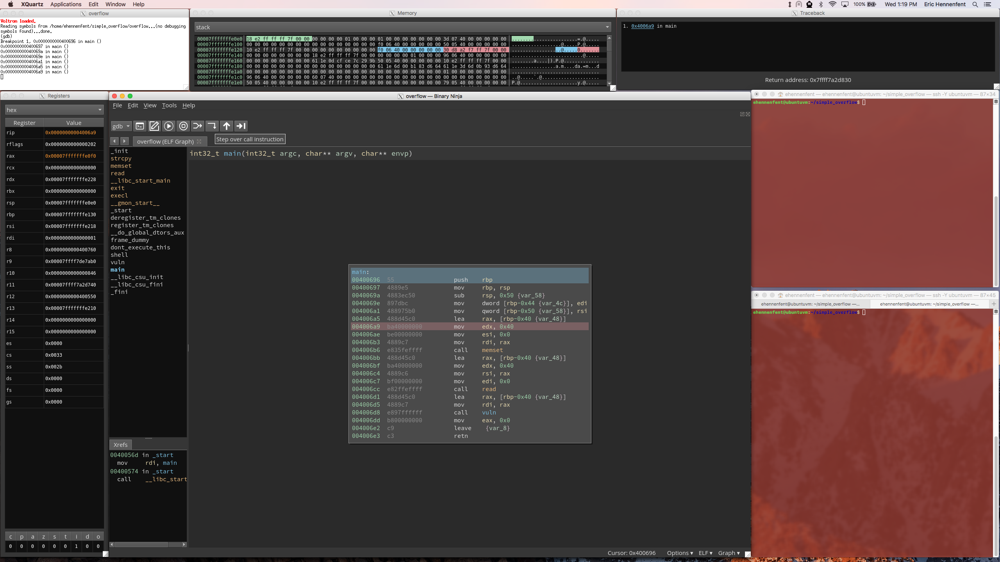

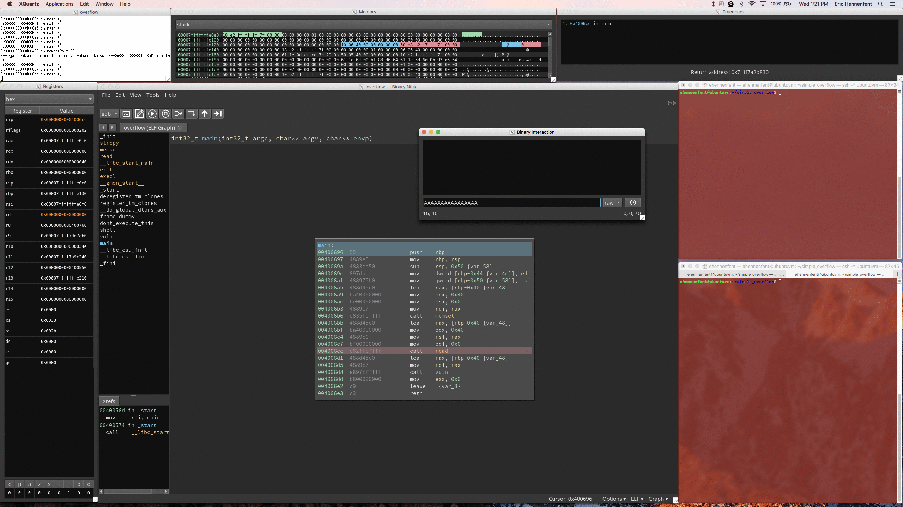


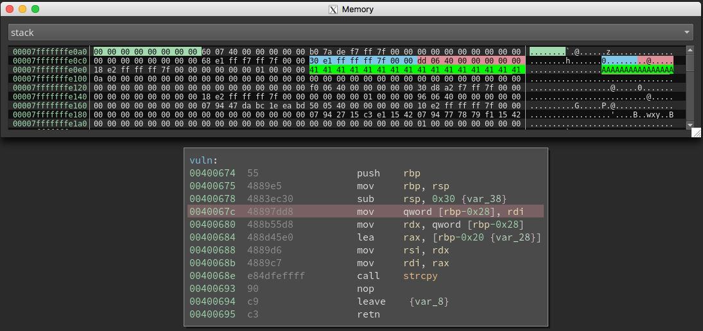


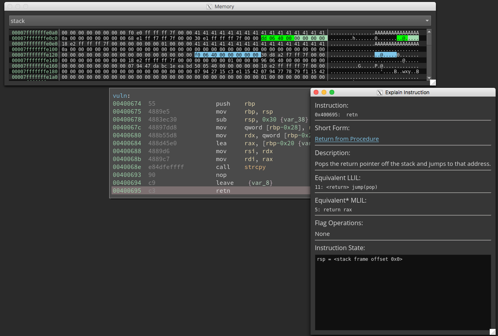

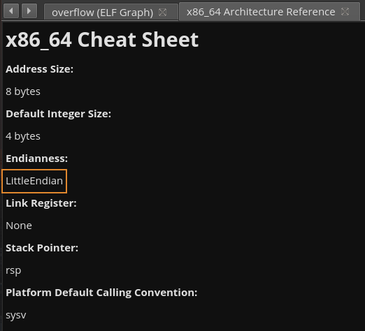

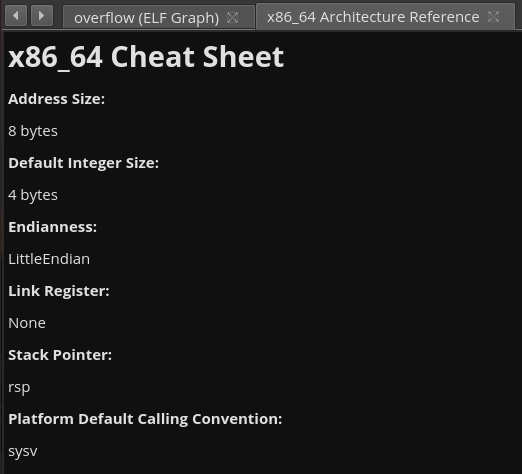

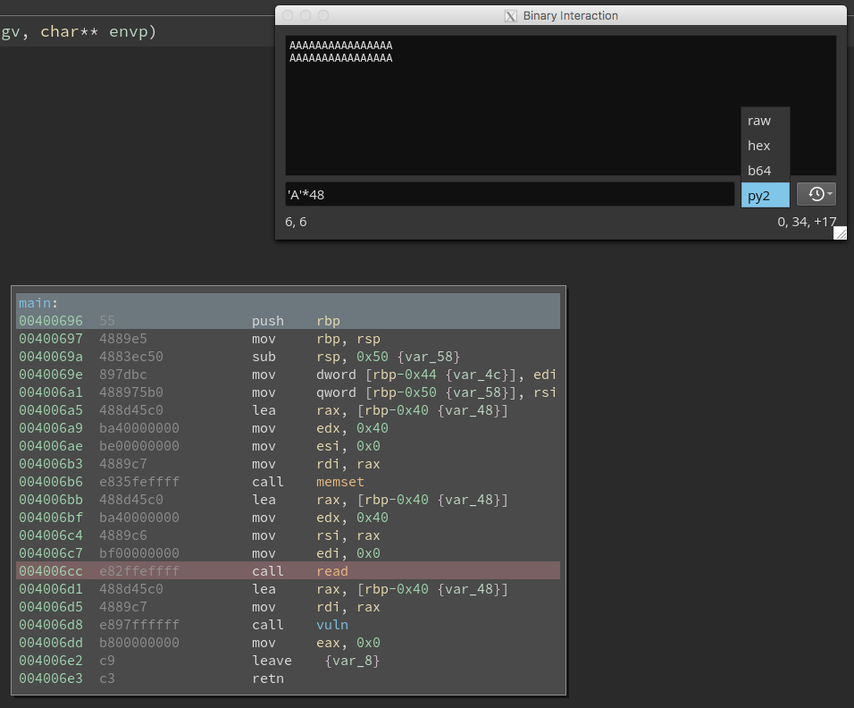

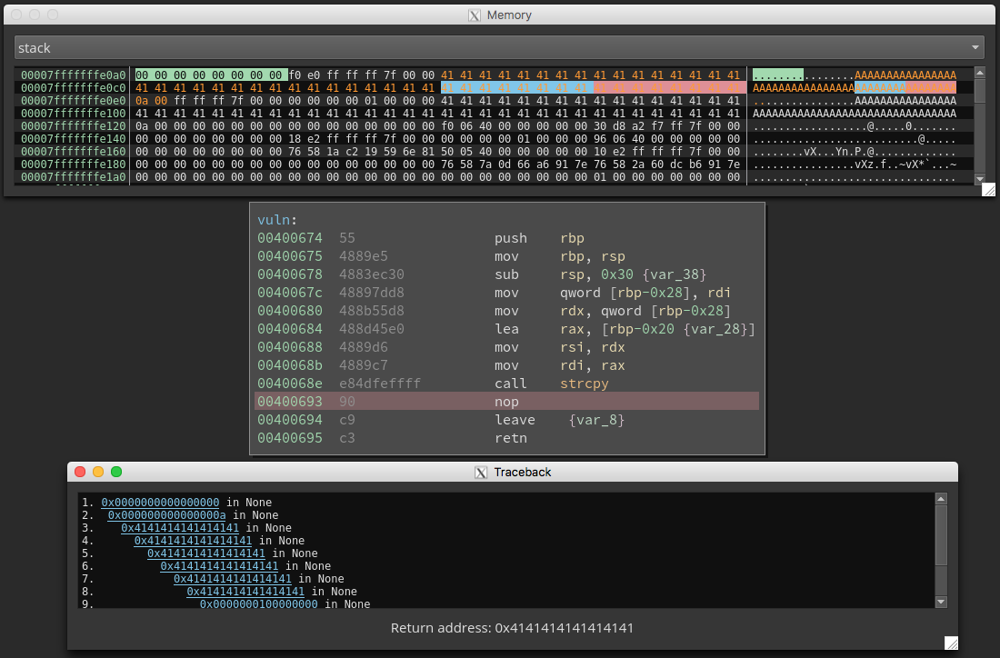

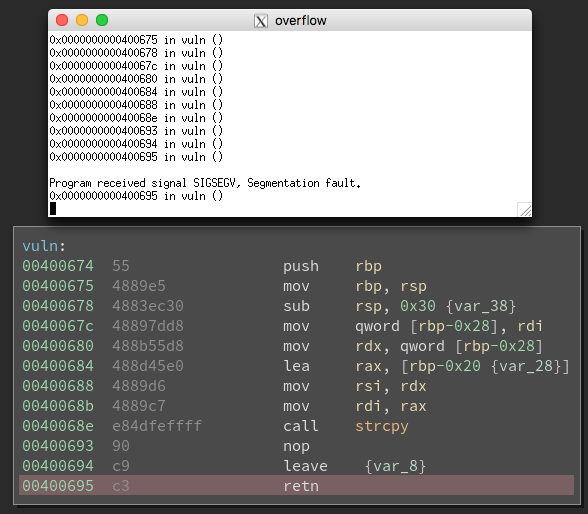


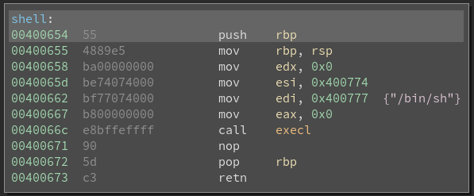

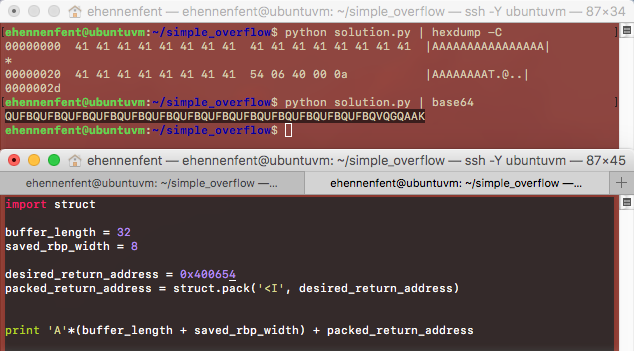

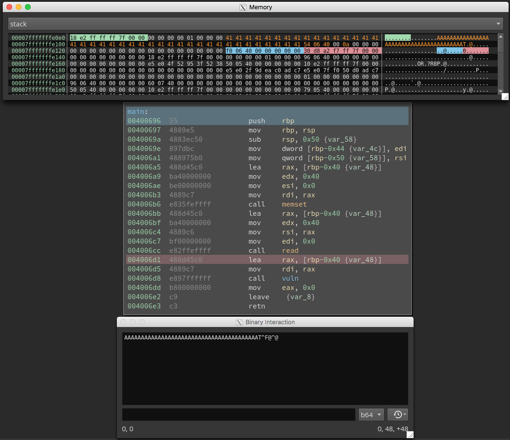

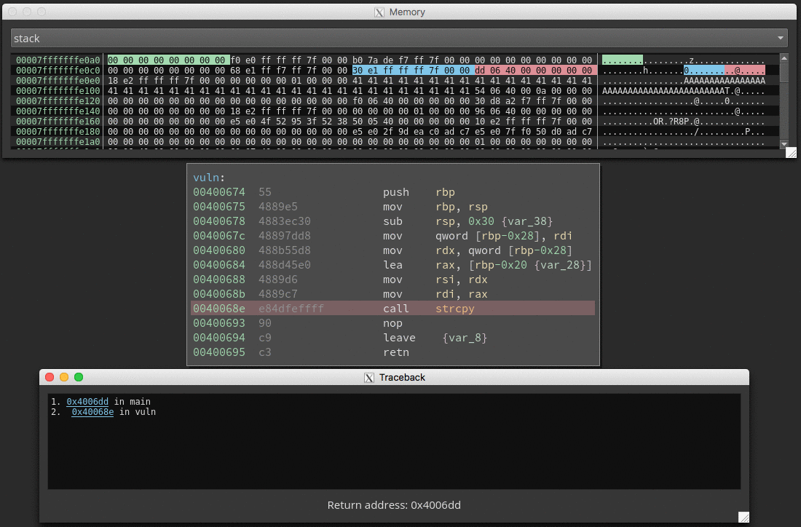


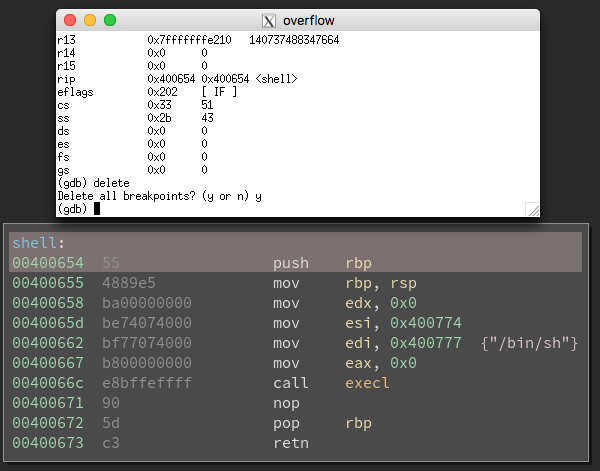

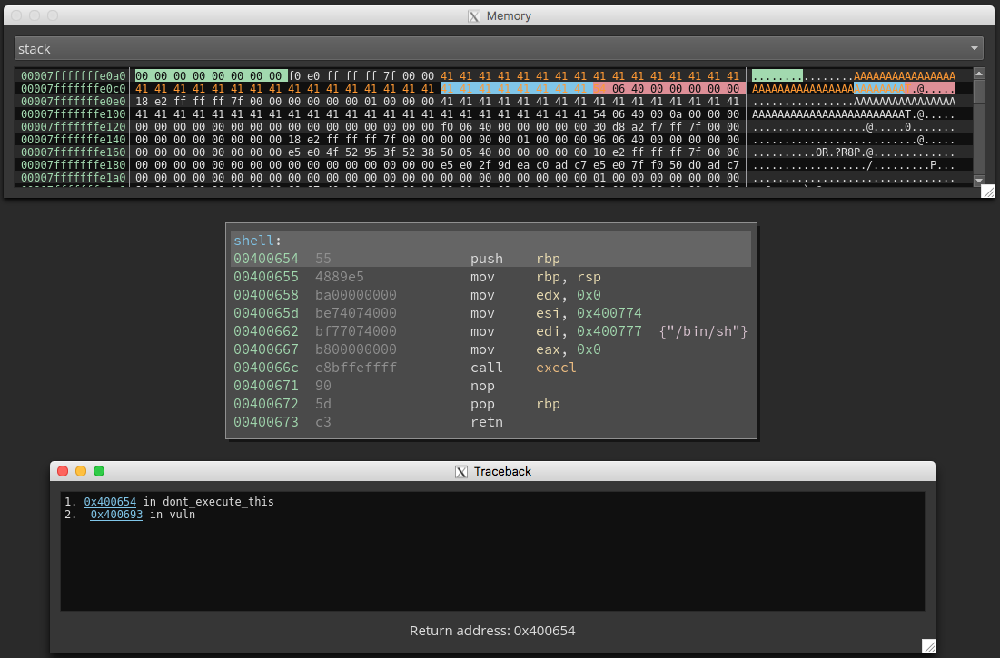

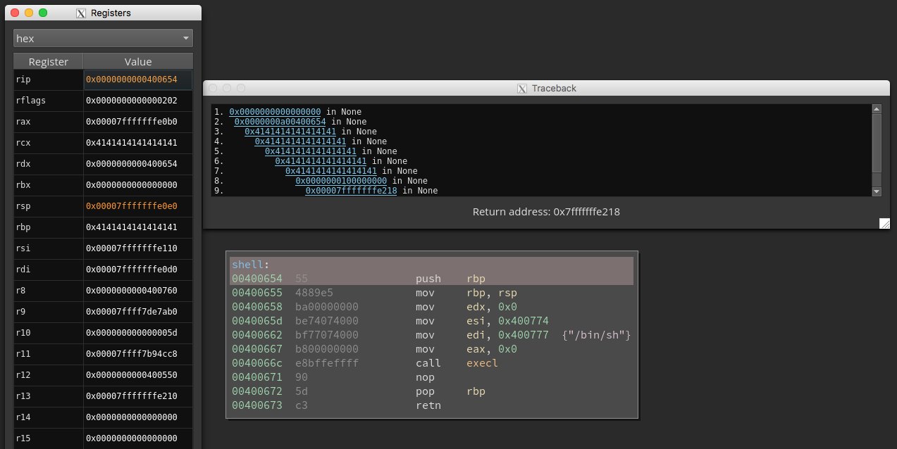


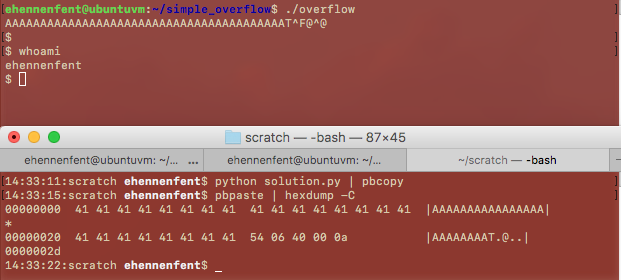

### Further Reading
This writeup focused on showcasing how the tools bundled with this plugin can aid a beginner in exploiting a program via a buffer overflow, not on how buffer overflows work. For more information on buffer overflows, consider reading the seminal work on the subject: [Smashing the Stack for Fun and Profit](https://www.eecs.umich.edu/courses/eecs588/static/stack_smashing.pdf).
