# Overflow 1 Writeup

Once we've opened up the binary, the first step is to go to the Tools menu and click "Enable Dynamic Analysis Tools". This will jump the binary view to the main function and set a breakpoint there.
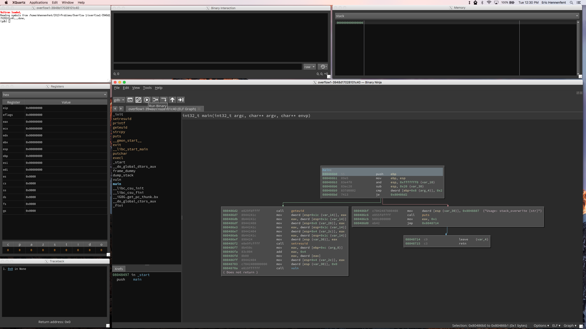

Just to try things out, we'll first run the binary without any input. After first hitting the Run button, then stepping execution a few times, you can see in the screenshot below that the binary has printed out usage information, and the instruction pointer has moved to a code path that simply exits. We'll finish stepping through to the exit, then try something else.
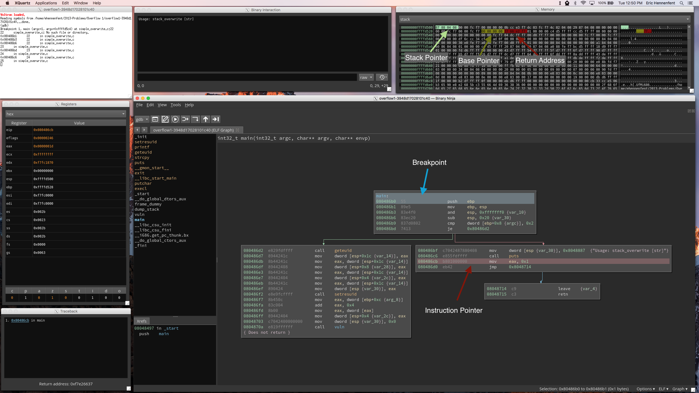

Let's pass the binary some input on the command line so that we can follow a code path that actually does something. We click the Set Argument button (highlighted in orange), change the argument mode to python 2.7, and enter the string `'A'*64`, which evaluates to a string of 64 A's.
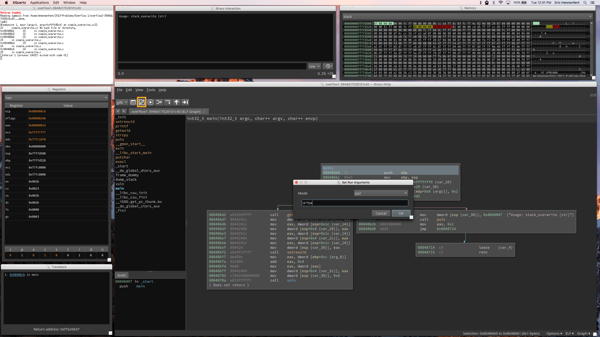

Now, when we step through the execution, you can see that the jump at `0x80486bd` takes us into a different basic block from before. This one looks more interesting than the other.
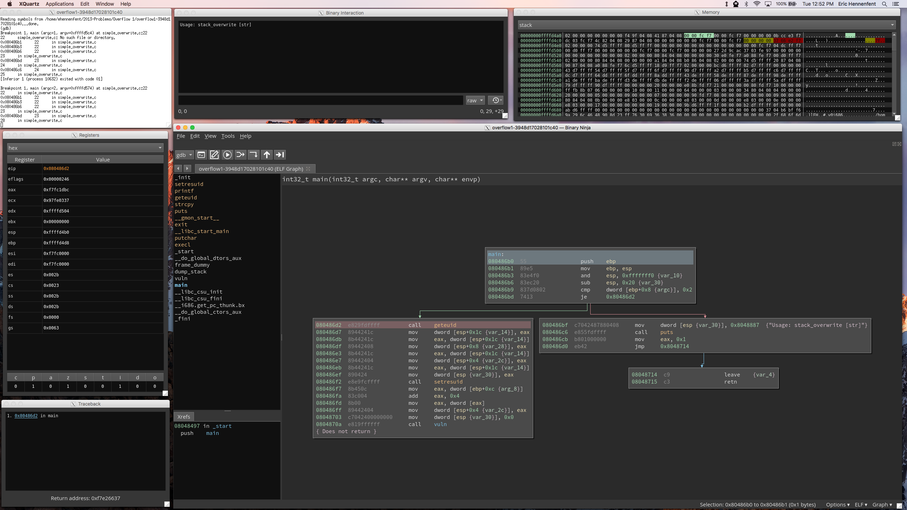

After stepping through the binary for a while, we end up in the `vuln` function. You can see the memory viewer has highlighted the top few rows in orange, corresponding to the shift in the stack pointer.
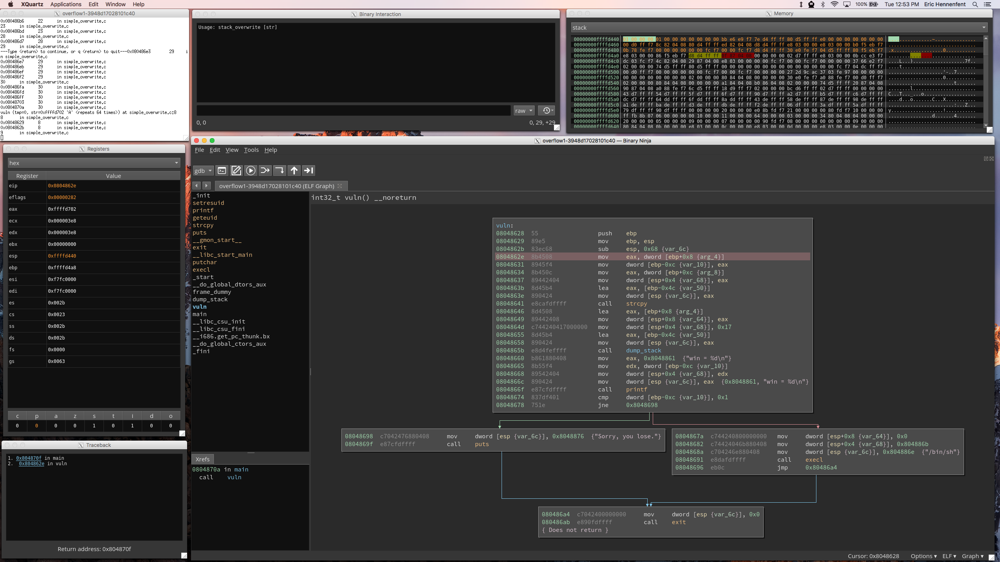

If we step past the call to `strcpy`, you can see the string of A's we passed on the command line has been copied into the memory at the above right. For the next step, we'll switch to the MLIL in order to get a more high-level overview of this function. Go to Options (highlighted in orange) --> Medium Level IL
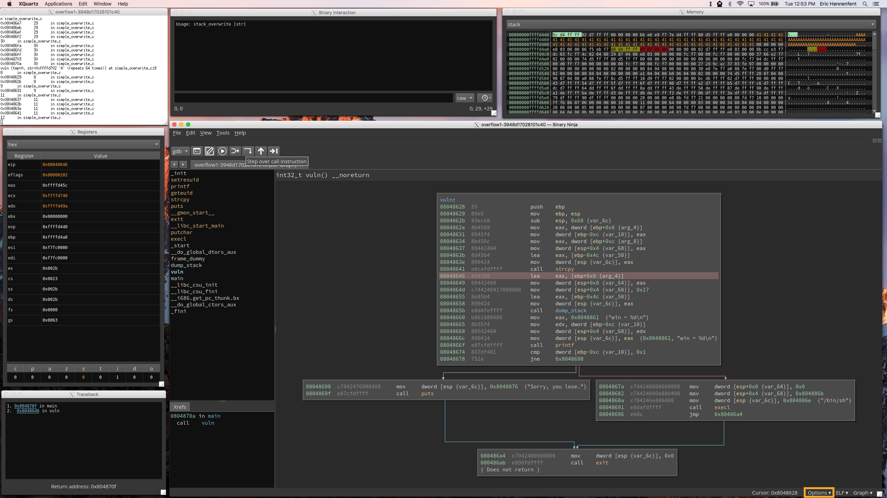

Let's look at the printf statement at instruction `0x8048861`. The first argument is the address of the format string displayed in the hint at right. The second, `var_68`, must be the value that corresponds to the `%d` in the format string. Let's go ahead and rename that variable (using the N hotkey) to make things a bit more clear.
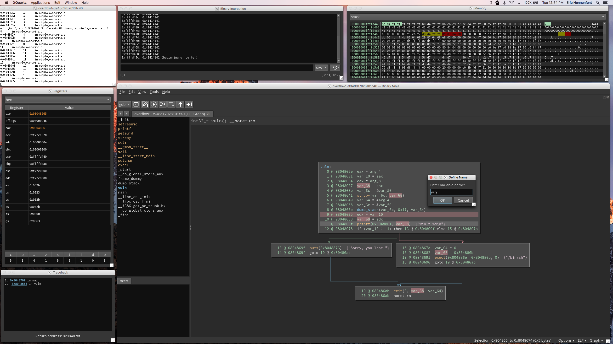

We need to figure how how `win` gets its value. Fortunately, the MLIL makes it easy to see that it is set by the previous instruction. It gets its value from the `edx` register, which we can follow another step back to see that `edx` is set by `var_10` at instruction 9. We'll rename `var_10` to `win_src`.
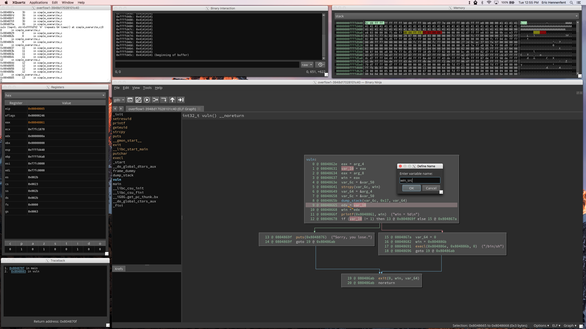

Changing the name of this variable makes it easy to notice instruction 12, where it's used in a conditional jump. If `win_src` is not equal to 1, the conditional jump takes us to instruction 13. Instruction 13 prints out "you lose", so it's probably safe to assume we don't want to take that branch. If `win_src` is equal to 1, conditional jump takes us to a block of code that appears to drop a shell. Let's try to figure out how we can make `win_src` be equal to 1.
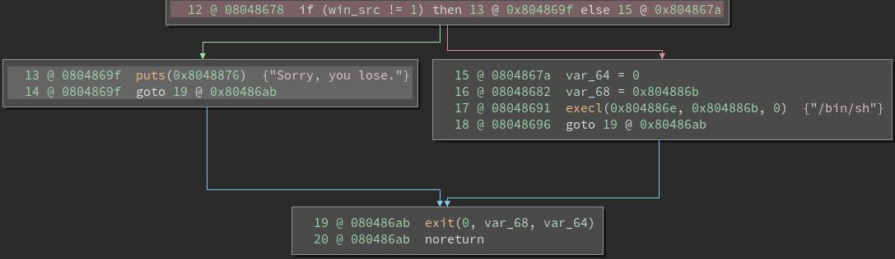

In this image, we've switched to the LLIL (Options --> Low Level IL) in order to try and determine where `win_src` lives in the program's memory. At LLIL instruction 17, we can see that it starts at `ebp - 0xc`. We'll make this display as a decimal so it's a little bit more readable.
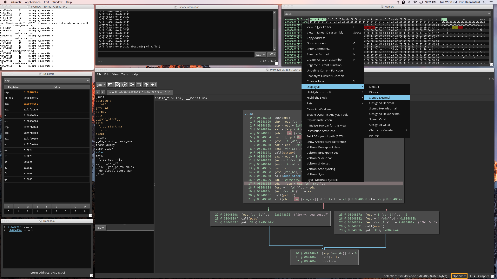

We can now see that `win_src` starts 12 bytes above the base pointer. I've marked off contents of the memory viewer in four-byte increments, and highlighted the four bytes at `ebp - 12`. We can see that they're all zero. Interestingly, it seems to start right after the end of all the A's we passed to the program. It's possible that we'll be able to overwrite it by passing a longer argument.

We continue stepping through execution until the program finishes. Since `win_src` was zero, the program prints out "Sorry, you lose"
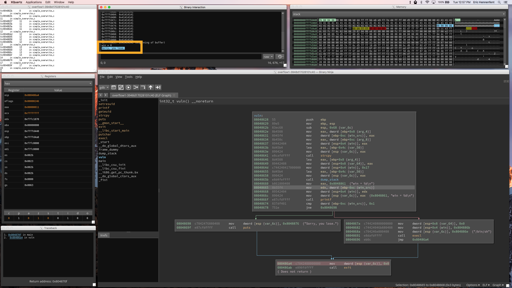

This time, let's try to make `win_src` equal to 1. We'll pass in the same 64 A's as before, but we'll also append a single `0x01`, which should hopefully fill the lowest byte of `win_src` on the stack.
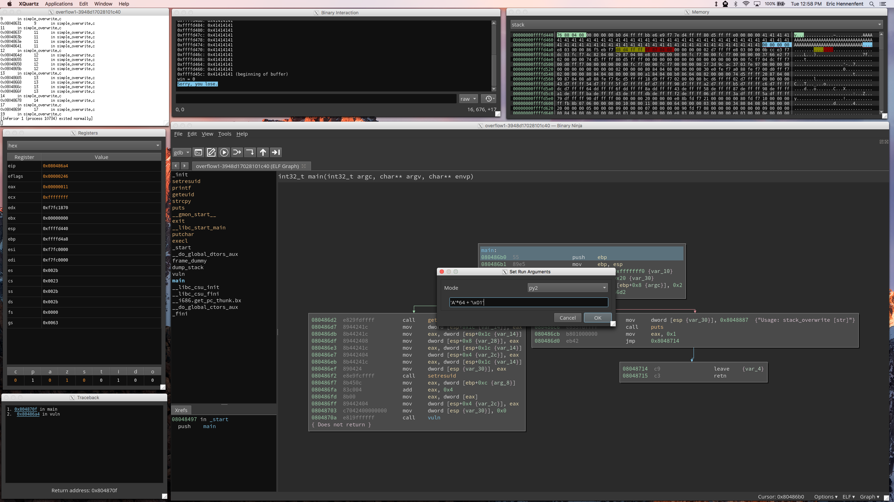

Rather than step through the whole program again, we'll set a breakpoint just before the call to `strcpy` and tell the debugger to continue execution until it gets there.
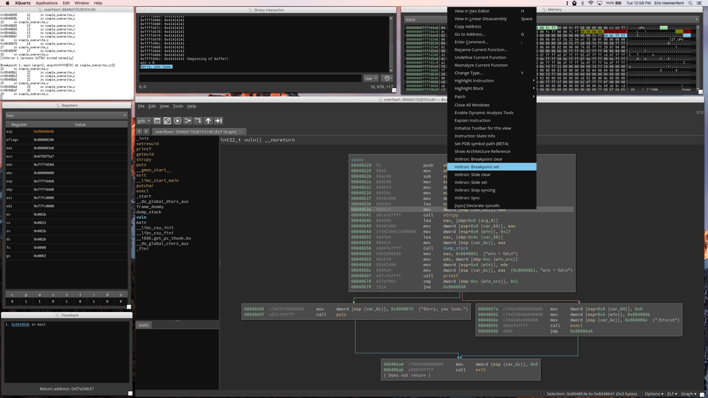

We'll hit the breakpoint, then step over the call to `strcpy`. We can now see that a `1` has been written into `win_src` (highlighted).

If we continue stepping through execution, instead of the program printing "you lose", we end up in the basic block that drops a shell.
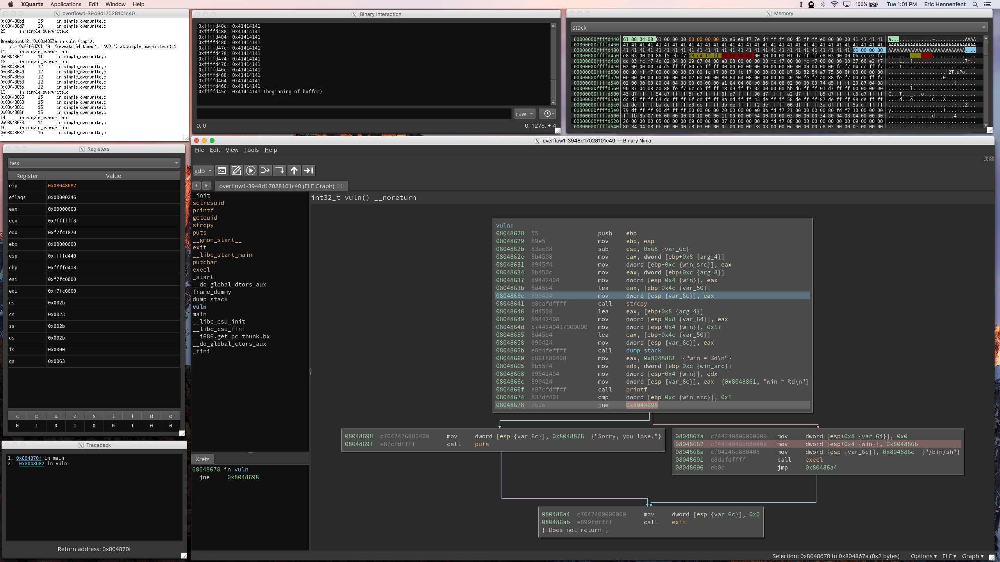

Before switching to the shell, we have to go into GDB and tell it to clear all the existing breakpoints. Otherwise, GDB will attempt to reinstate the old breakpoints as soon as it switches to executing `/bin/sh`, but it won't find the memory addresses it expects to, and will stall. In order to get around this, we delete the breakpoints, and tell binjatron not to restore them. We then press continue so the shell can run unimpeded.
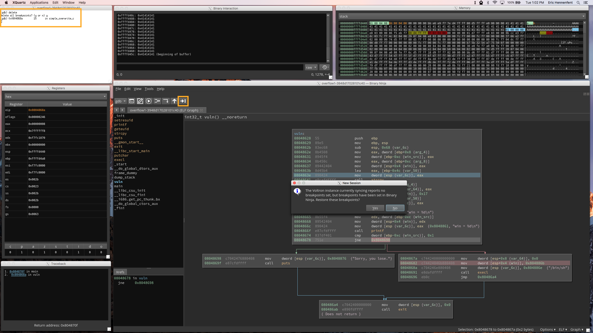

The shell has now bound itself to the interaction panel. You can see we've run the `whoami` command, which prints out the username of the current user.
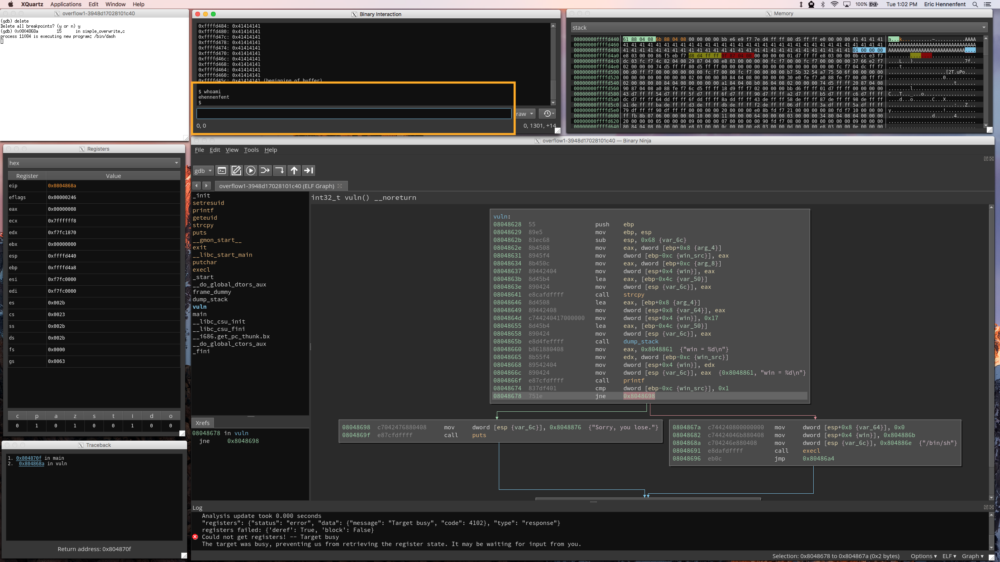
