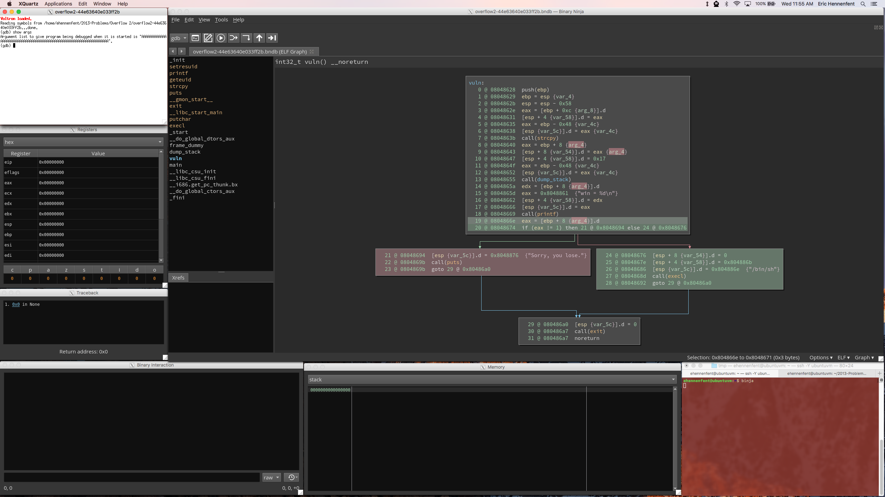
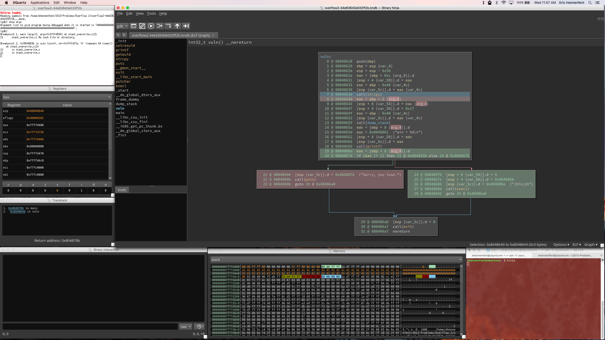
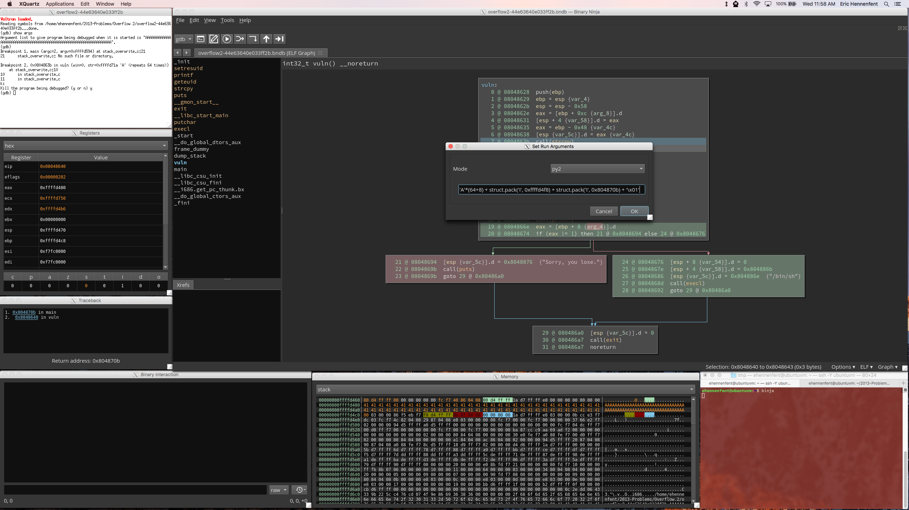
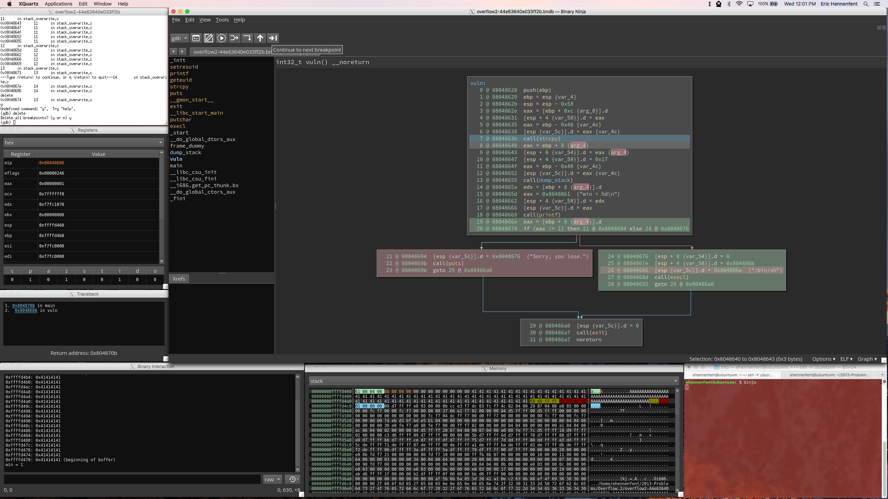

# Overflow 2 Writeup

Since Overflow 2 is so similar to Overflow 1, we'll skip most of the setup and go straight into analysis. There are several things to notice in the image below:
* We've opened the `vuln` function in LLIL mode
* We've highlighted the losing block in red
* We've highlighted the block that drops the shell in green
* We've also highlighted the conditional jump in green
* We've followed back the conditional on line 20 to line 19, which is where `eax` is most recently set

Line 20 tells us that in order to jump to the green block, `eax` has to be 1. On line 19, we can see that `eax` gets its value from a variable called `arg_4`, which is stored in memory at the address `ebp + 8`.

Let's pass the program 64 A's like we did for Overflow 1, then run it and see what happens. We'll go ahead and set a breakpoint at the call to `strcpy`, then step over to the next instruction. Now that the program is running and the argument we passed has been copied into memory, we can figure out what we need to do to overwrite `arg_4`. I've highlighted `ebp + 8` in the memory viewer. The string of 'A's we entered ends at the end of the previous line, so we come up a total of 16 bytes short - 8 for the remaining stack space after the A's, 4 for the saved base pointer, and 4 for the return address.

Now that we know where `arg_4` lives in memory in relation to the buffer we have access to, we'll construct our exploit. The first 72 A's fill up the memory leading up to the base pointer. Next, we use `struct.pack` to convert the integer addresses of the saved base pointer and the return address into little-endian byte strings. Finally, we'll add `0x1` to the end to overwrite `arg_4`.

Strictly speaking, we don't need to bother preserving the saved base pointer and the return address. Since they're not used until we try to return from the `vuln` function, the shell still drops as normal so long as we overwrite `arg_4` with a 1. If we exited the shell and tried to return from the function after clobbering them, the program would almost certainly segfault. However, a segfault _after_ we've already gotten a shell is hardly a problem.

We'll now run the binary with our exploit. We'll once again skip to the instruction just after the call to `strcpy`. We can see in the memory viewer that we've successfully written a 1 into `arg_4`! We also managed to preserve the return address. The stack frame below us shifted, so we ended up clobbering the lowest byte of the saved base pointer, but as we noted before, that won't prevent us from getting a shell.

Once again, we pause before the call to `execl` and delete the breakpoints so that GDB won't throw errors when it switches targets.

Once we've deleted the breakpoints, we continue execution, and get a shell.

